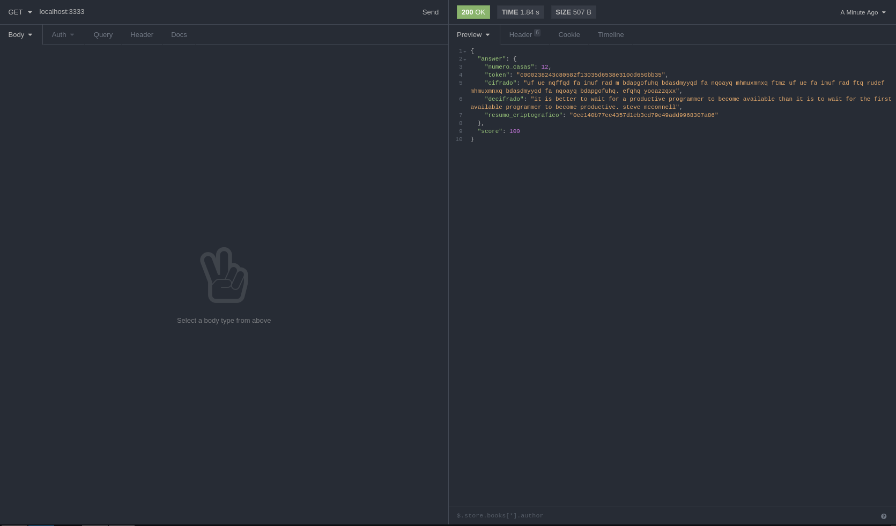

<h2 align="center">

  
   
  🚀 Desafios Codenation
</h2>

  
  
  
  

## :book: Sobre o projeto

 Este foi um projeto desenvolvido nos dias 04 de março de 2020 no AceleraDev da Codenation. Serão desafios lançados durante o evento AceleraDev.

#### 1º - Desafio:

- **[Criptografia de Júlio César - 100% Concluído - Nota máxima](https://github.com/felsantiago/challenges-codenation-api/blob/master/desafios/desafio01.md)**

## Tecnologias e ferramentas

 <ul>
  <li>Node.js</li>
  <li>Javascript</li>
  <li>Nodemon</li>
  <li>Sucrase</li>
  <li>Eslint</li>
 </ul>

## Rodando o projeto:

1 - Clone o projeto e o abra utilizando seu editor preferido.

2 - Rode um `npm install` ou `yarn` na pasta do projeto.

3 - Crie uma nova conexão do PostgresSQL ou acesse usando o usuário padrão (postgres)

4 - Renomeie o arquivo `.env.example` para `.env`. Altere os valores das variáveis de ambiente conforme a sua necessidade

5 - Rode um `npm dev` ou `yarn dev` para executar o servidor.

## Preview

